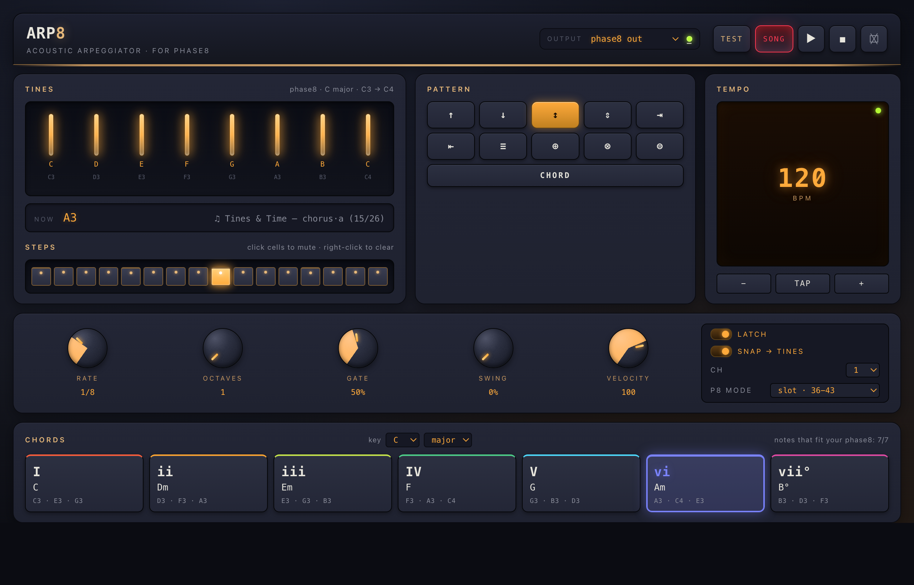

# ARP8

A web-based MIDI arpeggiator for the [Korg phase8](https://www.korg.com/us/products/dj/phase8/) acoustic synthesizer. Runs in Chrome on macOS via the Web MIDI API — no installer, no patching, no DAW.


## What it is

The phase8 is Korg Berlin's eight-voice acoustic synth: eight steel resonators, electromechanically excited, swappable, tuneable. It's a beautiful instrument with a built-in step sequencer, but for "play around with chord progressions" the on-board UI is overkill. ARP8 is the opposite of that — a single page where you click a chord pad and a chord arpeggiates onto your phase8 over USB-MIDI.

It's built around the assumption that you're a music novice (chord pads labelled with both Roman numerals *and* names; key/scale aware; nothing outside the phase8's installed resonators), but the engine is general enough to drive any MIDI device.


## The SONG button — "Tines & Time"



Press SONG and ARP8 plays a 2-minute generative composition I wrote called *Tines & Time*. It's a single-take demonstration of every CC the phase8 exposes (per manual §12.0):

- **AIR slider** (CC 30) opens scene by scene — tight + dry intro, half-open verses, fully-open chorus near feedback territory, then exhales for the outro
- **Mod Depth / Mod Rate** (CC 28/29) swell from settled in the verses to full psychedelic shimmer in the bridge
- **Envelope per resonator** (CC 20–27) and **Velocity per resonator** (CC 12–19) get broadcast at scene boundaries, with a small per-slot random offset so the eight tines never behave identically

**Structure**
1. Intro (88 BPM, soft) — settles into C major
2. Verse 1 (88 BPM) — classic I-V-vi axis pattern, simple up arp
3. Sudden 1-bar **pause** — silence between verses
4. Verse 2 (88 BPM) — same chords lifted to two octaves with updown
5. Pre-chorus (88 BPM) — converge/diverge patterns build tension
6. **Chorus** (105 BPM **tempo lift**) — vi-IV-I-V uplift, 3 octaves, AIR near max
7. **Cage interlude** — slows to 60 BPM, then 30 BPM (almost stopped). Single tines repeat hypnotically: just C3, then just G3, then a single C4 at near-standstill, then total silence
8. **Bridge** (78 BPM) — Pachelbel descent (vi-iii-IV) with full chaos (`chaos: 0.65` random-walks AIR + Mod CCs every beat — this is where it gets weird)
9. **Burst** (140 BPM **sudden climax**) — single bar of full-chord stab at velocity 127
10. Outro — decelerates 80 → 65 → 50 BPM, ending on a held I

Each scene specifies pattern, rate, octaves, gate, swing, velocity, BPM, and a CC payload. A `chaos` value (0–1) controls how much the player random-walks the global CCs every beat — set to 0 in the verses (stable timbre), spiked to 0.65 in the bridge (textural breakdown). The whole composition is in [`src/song.js`](src/song.js); the engine is [`SongPlayer`](src/song.js) and is fully unit-tested with the same virtual-clock harness as the arp scheduler.

The song forces phase8-friendly diatonic chords from the *current* key/scale, so you can press SONG in any key, but it was written for the default C major C3-C4 install.

## Inspirations

The visual language is industrial / Berlin / Korg-Berlin. Deep concrete bg, brushed-steel panels, brass tine resonators, amber phosphor for the screens. A mix of:

- **The phase8 itself.** The brass-and-concrete colour palette, the eight tine bars in the top-left of the UI mirroring the physical resonators, the warm wood-inlay accent under the header.
- **Make Noise faceplates.** Bold, monospace typography. High-contrast labels. Confidence over polish.
- **Mutable Instruments.** Restraint. Nothing extra. Each control earns its space.
- **Eurorack tactility.** Knurled SVG knobs with conic arc indicators that you drag vertically (Shift = fine). Scroll wheel works too.
- **Ableton Live's Arpeggiator.** Its pattern library is the canonical one — Up, Down, UpDown, Converge, Diverge, Played, Random, Random-Other, Random-Once, plus a "Chord" pattern that fires every note simultaneously. ARP8 implements all of them.
- **Vintage gear amber displays.** The BPM screen, knob value readouts, and now-playing readout are all glowing amber on near-black, with subtle phosphor bloom.
- **Berlin-techno colour-coded clip launchers.** The seven diatonic chord pads each take a colour from a curated nine-stop palette so a chord progression becomes a visual phrase.
- **John Cage's prepared-piano sonatas** — single-tine repetition, sudden tempo shifts, near-silence bordered by sudden bursts. The "Cage interlude" in the bundled song crashes the BPM from 105 to 30 with one tine hammering, then pauses to nothing, then explodes at 140.

## Features

- **SONG button** — plays *Tines & Time*, a 2-minute composition with full CC automation, tempo dynamics, pauses, and a Cage-style single-tine interlude (see above)
- **11 arpeggiator patterns** including all the Ableton standards
- **7 rates** from 1/4 down to 1/32, plus 1/4T, 1/8T, 1/16T triplets
- **Octave stacking** 1×–4×
- **Gate, swing, velocity** as drag-knobs (Shift for fine)
- **16-step rhythm grid** — click to mute / unmute steps; rests punch holes in the arp without losing position
- **Latch toggle** — chord-on-press vs. chord-stays-armed
- **Snap-to-tines** — quantises any chord note onto your installed phase8 resonators (preserving note class; F4 with no F4 tine becomes F3, never the chromatically nearest)
- **Key + mode picker** — generates the seven diatonic chords for any key in major or natural minor
- **Phase8 mode selector** — handles Korg's three "MIDI Note Assignment" modes (see below)
- **Tap tempo + ±BPM**, MIDI channel select, all-notes-off panic, and a TEST button that fires a single C3 to verify your MIDI path
- **Live MIDI monitor** in the footer showing the last byte sent
- **Keyboard shortcuts**: Space play/stop, 1-7 chord pads, Esc panic

## Quickstart

```bash
git clone git@github.com:johnusher/Arp8.git
cd Arp8
npm run serve     # http://localhost:8080
```

Open in **Chrome or Edge** on macOS. (Safari and Firefox don't ship Web MIDI as of 2026.) Plug in your phase8, allow the MIDI permission prompt, click a chord pad.

If you don't have a phase8: append `?demo` to the URL to see the UI populated with mock state.

## Retuning your phase8

The phase8 ships with **13 chromatically tuned steel resonators** and you install **8 at a time** in the eight slots. They're physically swappable — loosen the stabiliser screw with the included 2.5 mm hex key, slide one out, slide another in. Per manual §7.1.

You can also **fine-tune each resonator** by sliding it in or out of its mount: longer = lower pitch, shorter = higher pitch (manual §7.2). Tune by ear or against a tuner. After any swap or tune-up, **calibrate** with `SELECT + power-on` so the synth re-learns its scale.

This makes the phase8 a serious instrument for **alternative tunings** — equal-tempered scales beyond C major, just intonation, microtonal layouts, custom modes, even percussive setups where you intentionally detune the resonators away from any musical pitch. Korg Berlin has signalled future "resonator drops" with new tonal palettes (extra-bass packs, etc.) and the launch edition includes three precision-crafted experimental shapes. Communities at Superbooth showings have already shown people building their own scales on the unit.

**What this means for ARP8:** the chord engine currently assumes the default C major C3-C4 layout (`phase8Tines()` in [`src/chords.js`](src/chords.js) returns `[C3, D3, E3, F3, G3, A3, B3, C4]`). If you've retuned to something exotic, you have two options:

1. **Edit `phase8Tines()`** in `src/chords.js` to list the MIDI pitches you've actually installed. Diatonic chord generation, snap-to-tines, and the on-screen tine labels will then reflect your custom scale. The chord pads may go out-of-range for many keys — that's not a bug, it's the constraint of your install. (Future: a UI editor for tine layout.)
2. **Switch the phase8 to "Frequency Based" MIDI mode** (`SELECT + power-on` calibration auto-assigns the MIDI map), then set ARP8's `p8 mode` dropdown to `pitch · calibrated`. Now MIDI on the wire matches your real pitches. Combined with edit (1) above, you get a fully consistent setup.

For non-pitched / percussive resonator setups, you're better off bypassing the chord engine entirely: use the "played" pattern, click chord pads as triggers (each pad sends a fixed slot set), and treat ARP8 as a polyrhythmic step trigger.

## Phase8 MIDI mode — important

Per the phase8 manual §8.4 ("MIDI Note Assignment"), the synth ships in **STATIC** mode where the eight resonator slots receive on **MIDI 36-43 chromatically**, *regardless of the pitch of the resonators you've installed*. So a "C3 Note On" (MIDI 48) will be ignored by a default-configured phase8 even if you have a C3 resonator in slot 1.

ARP8 defaults to STATIC mode — pitches generated by the chord engine get translated to slot-MIDI before they hit the wire. The dropdown labelled `p8 mode` in the switches panel lets you switch:

| Mode | What phase8 expects | When to pick it |
|---|---|---|
| `slot · 36-43` | MIDI 36-43 → slots 1-8 | Phase8 factory default. Use this unless you've changed the synth's globals. |
| `pitch · calibrated` | MIDI matches resonator pitch | You've put your phase8 in "Frequency Based" mode (auto-calibrated on power-on). |
| `slot +2oct · 60-67` | MIDI 60-67 → slots 1-8 | You've enabled the "MIDI Transpose" global parameter. |

The tine UI always shows pitch (e.g. "C3"); the wire MIDI is whatever the selected mode dictates.

## Architecture

Pure ES modules, no build step.

```
index.html, styles.css        — single-page UI
src/chords.js                 — note theory, diatonic chord generator, snap-to-tines, phase8 slot mapping
src/arp.js                    — pattern engine (Up / Down / UpDown / Converge / Diverge / Random*3 / Played / Chord)
src/scheduler.js              — Chris-Wilson-style lookahead scheduler (25 ms tick, 100 ms ahead),
                                clock and sender are injectable so it tests headlessly
src/song.js                   — "Tines & Time" composition + SongPlayer; per-scene BPM, explicit
                                notes for pauses & Cage repetition, phase8 CC table, chaos jitter
src/midi.js                   — Web MIDI bridge (device list, panic, sendCC, send-with-log)
src/app.js                    — UI controller; knobs, chord pads, tine animations, keyboard
serve.js                      — 30-line static-file server
```

The engine modules know nothing about the DOM or about Web MIDI. The scheduler takes `{ now, send, schedule, cancel }` as its dependencies, so the test harness drives it with a `VirtualClock` and a `MockMIDIOutput` that records every byte stream sent. That's how 57 tests run in 200 ms with deterministic output — no flake, no `setTimeout` in the tests, no real MIDI required.

## Testing

```bash
npm test
```

72 tests across 8 suites:

- **syntax** — `node --check` every `src/*.js`, plus an import-resolution sanity test for `src/midi.js` (which the unit tests don't otherwise touch)
- **chords** — note theory, diatonic chord generation in major / minor, `snapToTines` correctness including the note-class-preservation rule
- **arp** — every pattern, octave expansion, randomness-with-seed determinism
- **scheduler** — interval math, gate/swing/channel/velocity, per-step grid, `onStep` UI hook fires for rests too
- **integration** — full pipeline from chord pad to wire bytes
- **flow** — multi-bar progressions, latch behaviour, panic semantics
- **phase8 mode** — STATIC / FREQUENCY / TRANSPOSED translation tables
- **song** — composition shape (BPM variation, pauses, Cage scenes), scene timing under variable BPM, CC payload structure, chaos behaviour with seeded RNG

## Browser support

- ✅ Chrome / Chromium / Edge / Brave on macOS
- ❌ Safari (no Web MIDI)
- ❌ Firefox (Web MIDI is behind a flag and unstable)

Web MIDI requires a secure context — `localhost` qualifies, so no HTTPS needed for local use.

## License

MIT.
